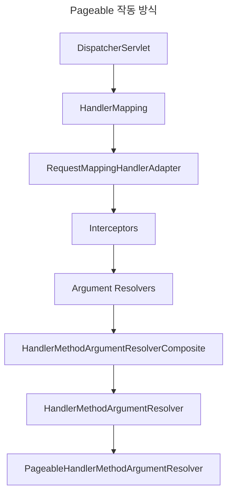

```mermaid
---
title: Pageable 작동 방식
---
graph TD
DispatcherServlet --> HM[HandlerMapping]
HM --> RMHA[RequestMappingHandlerAdapter]
RMHA --> IC[Interceptors]
IC --> AR[Argument Resolvers]
AR --> HMARC[HandlerMethodArgumentResolverComposite]
HMARC --> HMAR[HandlerMethodArgumentResolver]
HMAR --> PHMAR[PageableHandlerMethodArgumentResolver]
```